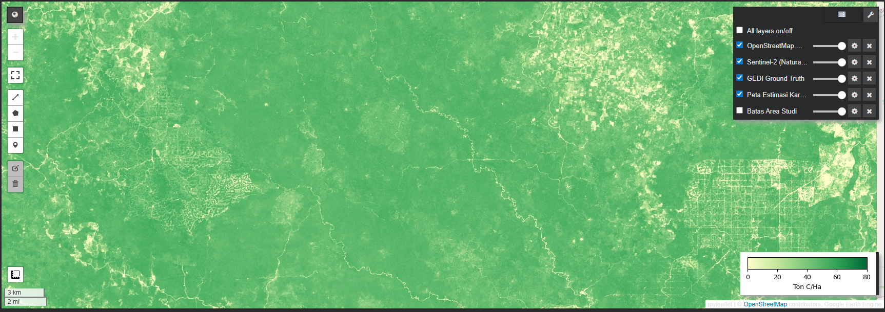
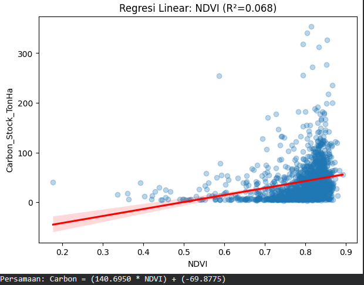
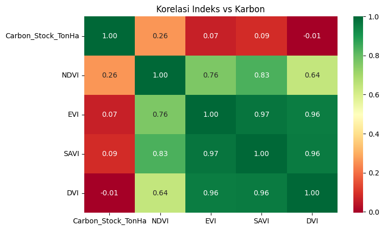

# Carbon Stock Estimation using GEDI & Sentinel-2

## 📌 Project Overview
This project performs spatial estimation of **Aboveground Carbon Stock** in the **Hutan Harapan Restoration Ecosystem (Jambi, Indonesia)**. By fusing sparse LiDAR data from **NASA GEDI** (Global Ecosystem Dynamics Investigation) with continuous optical imagery from **Sentinel-2**, this project produces a high-resolution (10m) carbon density map.

## 🎯 Objective
To upscale discrete GEDI biomass samples into a continuous spatial map to monitor forest health and degradation in tropical restoration areas.

## 🛠️ Tech Stack & Tools
* **Platform:** Google Earth Engine (Python API / `geemap`)
* **Languages:** Python (Pandas, Seaborn, Matplotlib, Scipy)
* **Data Sources:**
    * **Target:** GEDI L4A (Aboveground Biomass Density) -> Converted to Carbon using IPCC factor (0.47).
    * **Predictor:** Sentinel-2 Surface Reflectance (Harmonized).

## 📊 Methodology
1.  **Data Acquisition:** Aggregated GEDI data (2019-2023) to maximize coverage in the ROI.
2.  **Preprocessing:** Applied cloud masking (QA60 band) to Sentinel-2 imagery to remove atmospheric noise.
3.  **Feature Engineering:** Calculated vegetation indices (NDVI, EVI, SAVI, DVI) as predictor variables.
4.  **Modeling:** Performed Linear Regression to model the relationship between spectral indices and carbon stock.
5.  **Mapping:** Applied the regression model to 10m Sentinel-2 imagery for final estimation.

## 📸 Results
**Estimated Carbon Stock Map (Hutan Harapan):**

* **Note**: This is a personal experimental project for learning purposes only. The results are intended to demonstrate the code pipeline, not for scientific use.
* **Validation:** The model successfully identifies high-density carbon areas (intact forest) vs. low-density areas (degraded land/open canopy).
* **Carbon Range:** The estimated carbon stock ranges from **0 to ~80 Ton C/Ha** in the study area.

## 📝 Usage
To reproduce the results:
1.  Clone this repository.
2.  Open the `.ipynb` file in Google Colab or Jupyter Notebook.
3.  Authenticate with Google Earth Engine.
4.  Run all cells sequentially.

---
*Created by Yohanes Pamungkas a.k.a yopamungkass - December 2025*
